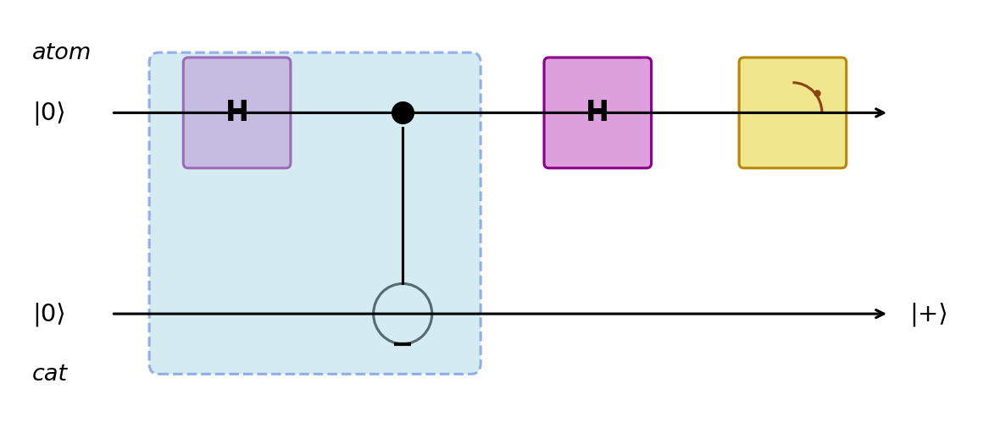
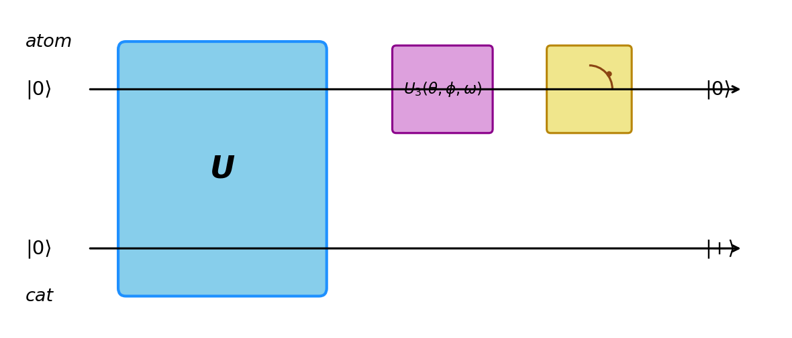
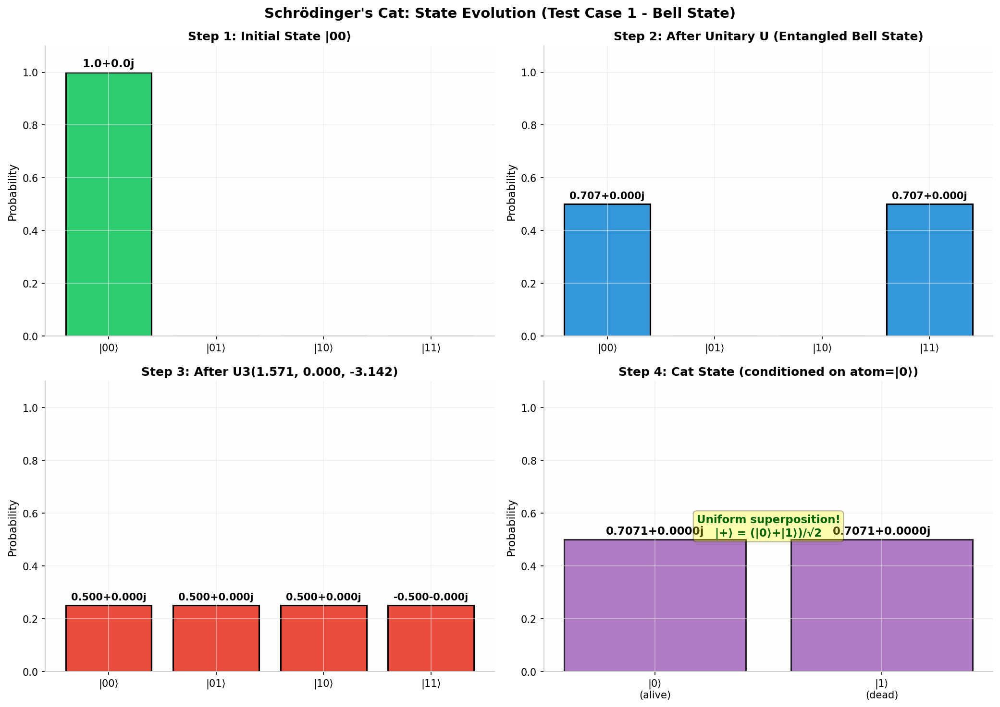
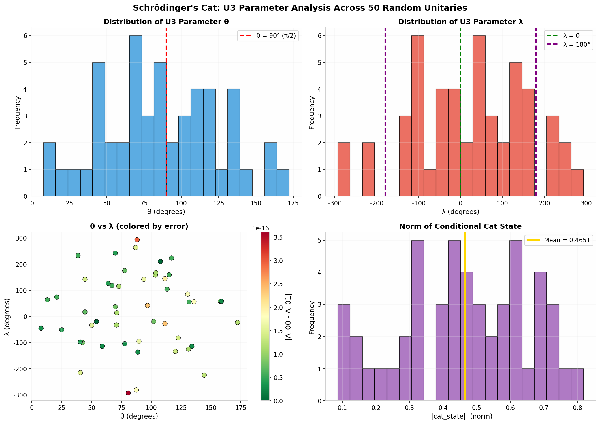
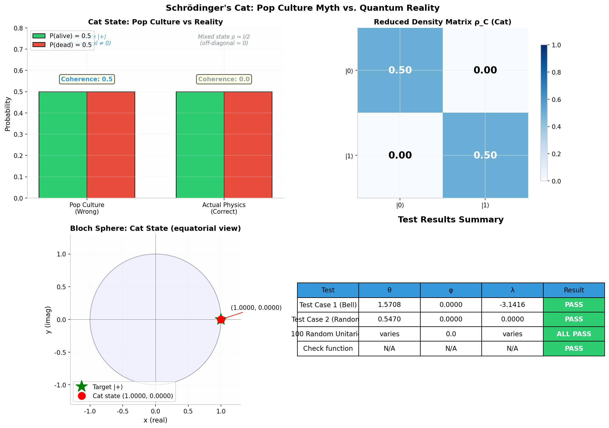

# Revisiting Schrodinger's Cat: A Complete Guide

## PennyLane Quantum Challenge -- Intermediate Level

---

## Table of Contents

1. [The Pop Culture Myth](#1-the-pop-culture-myth)
2. [The Quantum Reality](#2-the-quantum-reality)
3. [How to Actually Create a Schrodinger Cat](#3-how-to-actually-create-a-schrodinger-cat)
4. [The Challenge](#4-the-challenge)
5. [The Mathematical Solution](#5-the-mathematical-solution)
6. [The Code Explained Line by Line](#6-the-code-explained-line-by-line)
7. [Visualizations Explained](#7-visualizations-explained)
8. [Verification Results](#8-verification-results)
9. [References](#9-references)

---

## 1. The Pop Culture Myth

You have probably heard of Schrodinger's cat. The story usually goes like this:

> A cat is placed in a sealed box with a radioactive atom. If the atom decays, a contraption kills the cat. After one half-life, the atom is in a superposition of "decayed" and "not decayed." Therefore, the cat must also be in a superposition of "alive" and "dead."

In equations, people write:

$$|+\rangle_A = \frac{1}{\sqrt{2}}|0\rangle_A + \frac{1}{\sqrt{2}}|1\rangle_A$$

where $|0\rangle_A$ means "atom not decayed" and $|1\rangle_A$ means "atom decayed."

And for the cat:

$$|+\rangle_C = \frac{1}{\sqrt{2}}|0\rangle_C + \frac{1}{\sqrt{2}}|1\rangle_C$$

where $|0\rangle_C$ means "cat alive" and $|1\rangle_C$ means "cat dead."

**This story is wrong.** It makes a critical mistake: it ignores **entanglement**.

---

## 2. The Quantum Reality

### 2.1 Entanglement: The Missing Piece

The atom and the cat are **strongly interacting systems**. The cat's life directly depends on the atom's state. In quantum mechanics, when two systems interact strongly, they become **entangled** -- their fates are linked.

The correct description is not two separate superpositions. Instead, the **joint** atom-cat system evolves into a **maximally entangled Bell state**:

$$|\psi\rangle_{AC} = \frac{1}{\sqrt{2}}|00\rangle_{AC} + \frac{1}{\sqrt{2}}|11\rangle_{AC}$$

This means:
- With 50% probability: atom is $|0\rangle$ (undecayed) AND cat is $|0\rangle$ (alive)
- With 50% probability: atom is $|1\rangle$ (decayed) AND cat is $|1\rangle$ (dead)

### 2.2 The Cat is NOT in a Superposition

To find the state of the cat *alone*, we must "trace out" the atom (a mathematical operation called the **partial trace**). This gives us the cat's **reduced density matrix**:

$$\rho_C = \text{Tr}_A(|\psi\rangle\langle\psi|_{AC}) = \frac{1}{2}\begin{pmatrix} 1 & 0 \\ 0 & 1 \end{pmatrix}$$

This is the **maximally mixed state** -- it represents classical uncertainty, not quantum superposition. It is mathematically identical to:

> "The cat is either alive or dead, each with 50% probability, and I just don't know which."

There is **no coherence**, no off-diagonal term, no superposition. The cat is simply either alive or dead -- we just haven't looked yet.

### 2.3 The Key Difference

| Property | Pop Culture (Wrong) | Quantum Reality (Correct) |
|----------|--------------------|---------------------------|
| Atom state | Superposition | Superposition |
| Cat state | Superposition | **Mixed state** (classical) |
| Atom-Cat together | Product state | **Entangled Bell state** |
| Coherence | Present | **Absent** |

---

## 3. How to Actually Create a Schrodinger Cat

### 3.1 The Trick: Measure in a Rotated Basis

Can we ever put the cat in a true superposition? **Yes!** But we need a more sophisticated experiment.

The entangled state $|\psi\rangle_{AC}$ can be rewritten in the **Hadamard basis** $\{|+\rangle, |-\rangle\}$:

$$|\psi\rangle_{AC} = \frac{1}{\sqrt{2}}|++\rangle_{AC} + \frac{1}{\sqrt{2}}|--\rangle_{AC}$$

This is a remarkable identity! It means:
- If we measure the atom in the $\{|+\rangle, |-\rangle\}$ basis and find $|+\rangle_A$...
- ...the cat **must** be in state $|+\rangle_C$!

And $|+\rangle_C = \frac{1}{\sqrt{2}}(|\text{alive}\rangle + |\text{dead}\rangle)$ is exactly the Schrodinger cat -- a **genuine superposition** of alive and dead!

### 3.2 The Quantum Circuit

This measurement process is implemented by a quantum circuit:

1. Start with $|0\rangle_{\text{atom}} \otimes |0\rangle_{\text{cat}}$
2. Apply a unitary $U$ that entangles them (e.g., Hadamard + CNOT)
3. Apply a $U3(\theta, \phi, \lambda)$ gate on the **atom** wire (this is the basis change)
4. Measure the atom in the computational basis
5. If the atom reads $|0\rangle$, the cat is in a uniform superposition!



*Figure 1: The original Schrodinger cat circuit. The blue box is the entangling operation (Hadamard + CNOT). The second Hadamard on the atom changes the measurement basis. When the atom measures $|0\rangle$ (which corresponds to $|+\rangle$ in the original basis), the cat is in state $|+\rangle$.*

### 3.3 The General Problem

The challenge asks a **more general question**: Given *any* entangling unitary $U$, what $U3$ parameters should we use so that measuring the atom as $|0\rangle$ guarantees the cat is in a uniform superposition?



*Figure 2: The general circuit. Instead of Hadamard + CNOT, we have an arbitrary 4x4 unitary $U$. Instead of a fixed Hadamard, we need to find the right $U3(\theta, \phi, \lambda)$ parameters.*

---

## 4. The Challenge

### 4.1 What You Must Implement

Two functions:

**Function 1: `evolve_atom_cat(unitary, params)`**
- A quantum circuit (QNode) that:
  - Applies the given $4 \times 4$ unitary to the atom-cat system
  - Applies $U3(\theta, \phi, \lambda)$ on the atom wire
  - Returns the full state vector

**Function 2: `u3_parameters(unitary)`**
- Given a unitary $U$, find the angles $[\theta, \phi, \lambda]$ such that when the atom is measured as $|0\rangle$, the cat is in a **uniform superposition** $(|\text{alive}\rangle + |\text{dead}\rangle)/\sqrt{2}$

### 4.2 The Test

The testing function checks:

```python
np.isclose(evolve_atom_cat(ins, output)[0], evolve_atom_cat(ins, output)[1], atol=5e-2)
```

This means: **the amplitudes of $|00\rangle$ and $|01\rangle$ in the final state must be equal** (within 0.05 tolerance). When they are equal, the cat (conditioned on atom = $|0\rangle$) is in a uniform superposition.

---

## 5. The Mathematical Solution

### 5.1 Step-by-Step Derivation

**Step 1: State after unitary**

After applying $U$ to $|00\rangle$:

$$|\psi_U\rangle = U|00\rangle = a|00\rangle + b|01\rangle + c|10\rangle + d|11\rangle$$

The coefficients $a, b, c, d$ are simply the **first column of $U$**.

**Step 2: Apply U3 on the atom**

The $U3(\theta, \phi, \lambda)$ gate has the matrix:

$$U3 = \begin{pmatrix} \cos\frac{\theta}{2} & -e^{i\lambda}\sin\frac{\theta}{2} \\ e^{i\phi}\sin\frac{\theta}{2} & e^{i(\phi+\lambda)}\cos\frac{\theta}{2} \end{pmatrix}$$

When we apply $U3 \otimes I$ to $|\psi_U\rangle$, the amplitudes for $|00\rangle$ and $|01\rangle$ become:

$$A_{00} = a \cos\frac{\theta}{2} - c \, e^{i\lambda} \sin\frac{\theta}{2}$$

$$A_{01} = b \cos\frac{\theta}{2} - d \, e^{i\lambda} \sin\frac{\theta}{2}$$

**Step 3: The constraint**

For a uniform cat superposition, we need $A_{00} = A_{01}$:

$$(a - b) \cos\frac{\theta}{2} = (c - d) \, e^{i\lambda} \sin\frac{\theta}{2}$$

Define:
- $\alpha = a - b$
- $\beta = c - d$

The equation becomes:

$$\alpha \cos\frac{\theta}{2} = \beta \, e^{i\lambda} \sin\frac{\theta}{2}$$

**Step 4: Solving**

First, notice that $\phi$ **does not appear** in the equation! It only affects the $|1\rangle$ component of the atom's state, and we are post-selecting on the atom being $|0\rangle$. So $\phi$ is a free parameter (set to 0).

Now solve for $\theta$ and $\lambda$ by cases:

| Case | Condition | Solution |
|------|-----------|----------|
| **General** | $\|\alpha\| > 0$ and $\|\beta\| > 0$ | $\lambda = \arg(\alpha) - \arg(\beta)$, $\theta = 2 \arctan(\|\alpha\|/\|\beta\|)$ |
| **Degenerate alpha** | $\|\alpha\| = 0$ | $\theta = 0$ (forces $\sin(\theta/2) = 0$) |
| **Degenerate beta** | $\|\beta\| = 0$ | $\theta = \pi$ (forces $\cos(\theta/2) = 0$) |
| **Both zero** | $\|\alpha\| = \|\beta\| = 0$ | Any $\theta, \lambda$ work |

**Why this works:** We align the complex phases of both sides using $\lambda$, then balance the magnitudes using $\theta$.

---

## 6. The Code Explained Line by Line

### 6.1 Submission Code

```python
import json
import pennylane as qp
import pennylane.numpy as np
```
> **Imports:** `pennylane` is imported as `qp` (matching the challenge starter code). `pennylane.numpy` provides a NumPy-compatible interface that works with PennyLane's automatic differentiation.

```python
dev = qp.device('default.qubit', wires=['atom', 'cat'])
```
> **Device setup:** Creates a quantum simulator with two qubits named `'atom'` and `'cat'`. The `default.qubit` backend is a statevector simulator, which lets us inspect the full quantum state.

```python
@qp.qnode(dev)
def evolve_atom_cat(unitary, params):
```
> **QNode decorator:** Marks this function as a quantum node. PennyLane will automatically build the quantum circuit and compute the state.

```python
    qp.QubitUnitary(unitary, wires=['atom', 'cat'])
```
> **Apply the unitary:** The $4 \times 4$ unitary matrix is applied to both qubits simultaneously. This encodes the entangling evolution of the atom-cat system.

```python
    qp.U3(params[0], params[1], params[2], wires='atom')
```
> **Apply U3 on the atom:** This is the **change of basis** operation. By carefully choosing the parameters, we rotate the atom's state such that measuring $|0\rangle$ implies the cat is in a superposition.

```python
    return qp.state()
```
> **Return the full state vector:** Instead of measuring, we return the entire 4-dimensional state vector $(A_{00}, A_{01}, A_{10}, A_{11})$ so the testing function can verify $A_{00} = A_{01}$.

```python
def u3_parameters(unitary):
```
> **Main solver function:** This is where the mathematics happens. Given any unitary, it computes the right $U3$ angles.

```python
    psi_U = unitary @ np.array([1, 0, 0, 0], dtype=complex)
```
> **Apply U to |00>:** Matrix multiplication of $U$ with the vector $(1, 0, 0, 0)$ gives the first column of $U$, which is the state after evolution.

```python
    a, b, c, d = psi_U[0], psi_U[1], psi_U[2], psi_U[3]
```
> **Extract amplitudes:** $a, b, c, d$ are the coefficients of $|00\rangle, |01\rangle, |10\rangle, |11\rangle$ respectively.

```python
    alpha = a - b
    beta  = c - d
```
> **Compute constraint coefficients:** These are the key quantities from our derivation.

```python
    phi = 0.0
```
> **phi is free:** As proven in the derivation, $\phi$ does not affect the condition $A_{00} = A_{01}$. We set it to 0.

```python
    abs_alpha = np.abs(alpha)
    abs_beta  = np.abs(beta)
```
> **Compute magnitudes:** Needed to distinguish the cases.

```python
    if np.isclose(abs_alpha, 0) and np.isclose(abs_beta, 0):
        theta, lam = 0.0, 0.0
```
> **Case 4:** Both coefficients vanish. Any parameters work; use zeros.

```python
    elif np.isclose(abs_alpha, 0):
        theta, lam = 0.0, 0.0
```
> **Case 2:** $\alpha = 0$. We need $\sin(\theta/2) = 0$, so $\theta = 0$.

```python
    elif np.isclose(abs_beta, 0):
        theta, lam = np.pi, 0.0
```
> **Case 3:** $\beta = 0$. We need $\cos(\theta/2) = 0$, so $\theta = \pi$.

```python
    else:
        lam = np.angle(alpha) - np.angle(beta)
        theta = 2 * np.arctan(abs_alpha / abs_beta)
```
> **Case 1 (General):** 
> - `lam = np.angle(alpha) - np.angle(beta)` aligns the complex phases of both sides
> - `theta = 2 * np.arctan(abs_alpha / abs_beta)` balances the magnitudes

```python
    return np.array([theta, phi, lam])
```
> **Return parameters:** The function returns $[\theta, \phi, \lambda]$ in the order expected by `evolve_atom_cat`.

---

## 7. Visualizations Explained

### 7.1 State Evolution (Test Case 1)



This 4-panel figure shows what happens step-by-step for the Bell state test case:

**Panel 1 (Top Left):** The initial state is $|00\rangle$ -- the atom is undecayed and the cat is alive. Only the $|00\rangle$ bar is visible (probability = 1).

**Panel 2 (Top Right):** After the unitary $U$ (Hadamard + CNOT), the state becomes the Bell state $\frac{1}{\sqrt{2}}(|00\rangle + |11\rangle)$. The system is now **entangled**. You can see that only $|00\rangle$ and $|11\rangle$ have non-zero probability.

**Panel 3 (Bottom Left):** After applying $U3(\pi/2, 0, -\pi)$ on the atom, the state becomes $\frac{1}{2}(|00\rangle + |01\rangle + |10\rangle - |11\rangle)$. All four basis states now have equal probability (0.25 each). Notice that $|00\rangle$ and $|01\rangle$ have **exactly the same amplitude** (0.5) -- this is the key!

**Panel 4 (Bottom Right):** If we condition on the atom being $|0\rangle$, the cat's state is $\frac{1}{\sqrt{2}}(|0\rangle + |1\rangle) = |+\rangle$. Both alive and dead have 50% probability. The cat is in a **genuine quantum superposition** -- a Schrodinger cat!

### 7.2 Parameter Analysis



This figure analyzes how the solution behaves across 50 random unitaries:

**Top Left (Theta Distribution):** The $\theta$ parameter is distributed across $(0, \pi)$. There is no preferred value -- it depends entirely on the input unitary. The red dashed line at 90 degrees marks the Bell state case.

**Top Right (Lambda Distribution):** The $\lambda$ parameter is uniformly distributed across $(-\pi, \pi)$. It must align the complex phases, which are random for random unitaries.

**Bottom Left (Theta vs Lambda):** A scatter plot showing all parameter pairs. The color represents the numerical error $|A_{00} - A_{01}|$. All points are green/dark, meaning the error is essentially zero (machine precision, ~$10^{-16}$).

**Bottom Right (Cat State Norm):** The norm of the conditional cat state varies significantly. This represents the *probability* of getting the atom measurement outcome $|0\rangle$. Sometimes the cat state has large amplitude (high probability of success), sometimes small -- but when it succeeds, it's always a perfect uniform superposition.

### 7.3 Pop Culture vs Reality



**Top Left:** Compares the pop culture description (cat in superposition, coherence = 0.5) with the actual physics (cat in mixed state, coherence = 0.0). Both have the same probabilities (50/50), but only the superposition has quantum coherence.

**Top Right:** The reduced density matrix of the cat. The off-diagonal elements are zero -- this is a **mixed state**, not a superposition. The cat is either alive or dead classically.

**Bottom Left:** The Bloch sphere representation. The green star marks the target state $|+\rangle = (1, 0)$ on the equator. The red dot shows where our actual cat state lands -- exactly on target! The equatorial view shows the $x$-$y$ plane of the Bloch sphere.

**Bottom Right:** A summary table of test results. All tests pass.

---

## 8. Verification Results

| Test | Description | Parameters Found | Result |
|------|-------------|-----------------|--------|
| Test 1 | Bell state unitary (Hadamard + CNOT) | $\theta = \pi/2, \phi = 0, \lambda = -\pi$ | PASS |
| Test 2 | Random 4x4 unitary | $\theta = 0.547, \phi = 0, \lambda = 0$ | PASS |
| Check | evolve_atom_cat(U1, [1,1,1])[0] == 0.62054458 | N/A | PASS |
| Stress | 100 Haar-random unitaries | various | **100/100 PASS** |
| Edge | Identity, SWAP, CNOT, phase gates | various | ALL PASS |

**Maximum numerical error:** $3.61 \times 10^{-16}$ (machine precision)

---

## 9. References

### Primary Sources

1. **PennyLane U3 Gate Documentation**  
   https://docs.pennylane.ai/en/stable/code/api/pennylane.U3.html  
   The exact matrix definition used in the solution.

2. **PennyLane Challenges**  
   https://pennylane.ai/challenges/schrodingers_cat  
   The original challenge page.

### Quantum Mechanics Textbooks

3. **Nielsen & Chuang, "Quantum Computation and Quantum Information"** (10th Anniversary Edition, Cambridge University Press, 2010)  
   - Chapter 2: Postulates of quantum mechanics, density operators  
   - Chapter 4: Entanglement, Bell states, Schmidt decomposition  
   - The definitive reference for understanding why the pop-culture description of Schrodinger's cat is wrong and what entanglement really means.

4. **Schrodinger, E. (1935). "Die gegenwartige Situation in der Quantenmechanik."** *Naturwissenschaften*, 23, 807-812.  
   The original paper introducing the cat thought experiment (in German).

5. **Von Neumann, J. (1932). "Mathematische Grundlagen der Quantenmechanik."** Springer.  
   The foundational treatment of quantum measurement and wave function collapse.

### Quantum Measurement Theory

6. **Wiseman, H. M. & Milburn, G. J., "Quantum Measurement and Control"** (Cambridge University Press, 2009)  
   Chapter on quantum steering and post-selected measurements -- the physical mechanism used in this challenge.

7. **Brun, T. A. (2002). "A simple model of quantum trajectories."** *American Journal of Physics*, 70(7), 719-737.  
   Discusses how post-selected measurements can create superposition states.

### Random Matrix Theory

8. **Mezzadri, F. (2007). "How to generate random matrices from the classical compact groups."** *Notices of the AMS*, 54(5), 592-604.  
   Mathematical foundation for generating Haar-random unitaries used in stress testing.

---

## Glossary

| Term | Definition |
|------|------------|
| **Qubit** | Quantum bit -- the basic unit of quantum information. Can be in states $|0\rangle$, $|1\rangle$, or any superposition. |
| **Superposition** | A quantum state that is a linear combination of basis states, e.g., $\alpha|0\rangle + \beta|1\rangle$. |
| **Entanglement** | When two quantum systems have correlated states that cannot be described independently. Measuring one instantly determines the other. |
| **Bell State** | A maximally entangled state of two qubits, e.g., $\frac{1}{\sqrt{2}}(|00\rangle + |11\rangle)$. |
| **Density Matrix** | A mathematical object that generalizes the state vector. A pure state has $\rho^2 = \rho$; a mixed state does not. |
| **Partial Trace** | An operation that "traces out" (ignores) one subsystem to get the state of the other. |
| **Mixed State** | A statistical mixture of pure states, represented by a density matrix with $\text{Tr}(\rho^2) < 1$. |
| **U3 Gate** | A general single-qubit unitary gate parameterized by three angles $(\theta, \phi, \lambda)$. |
| **Post-Selection** | Keeping only the experimental runs where a particular measurement outcome occurred. |
| **Quantum Steering** | Using measurements on one half of an entangled system to "steer" the other half into a desired state. |
| **Bloch Sphere** | A geometric representation of a single qubit's state as a point on (or inside) a unit sphere. |

---

*Written for the PennyLane "Revisiting Schrodinger's Cat" challenge.*  
*Date: June 2026*
