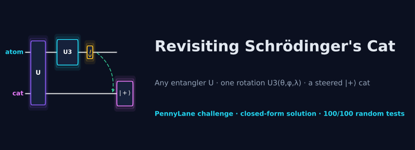
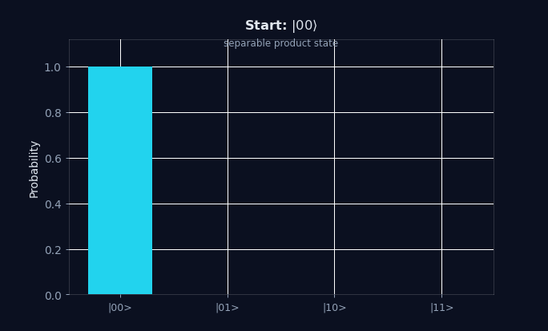
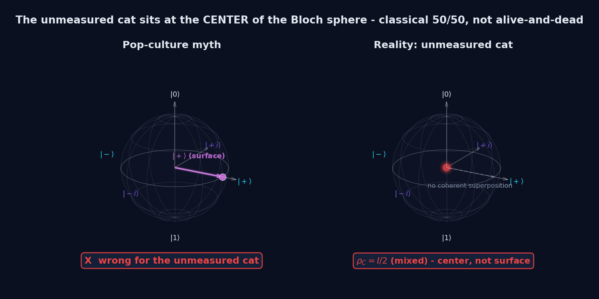
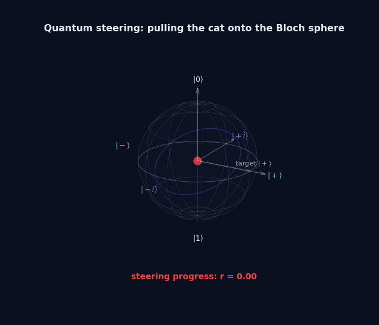
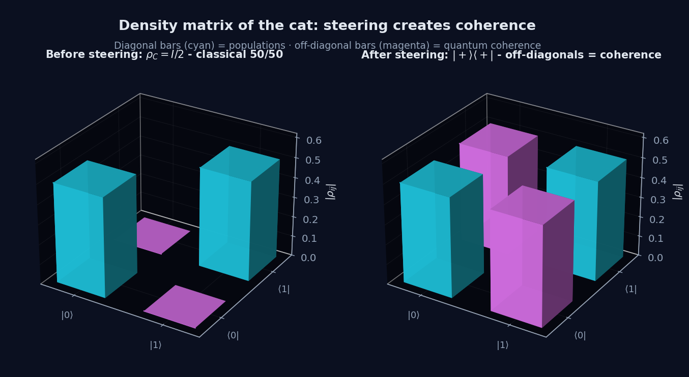
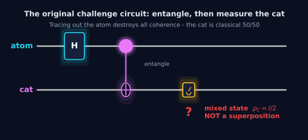
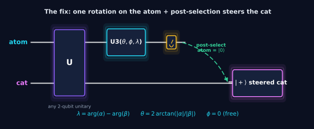
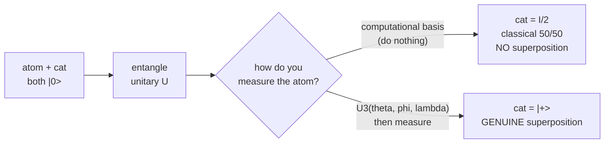
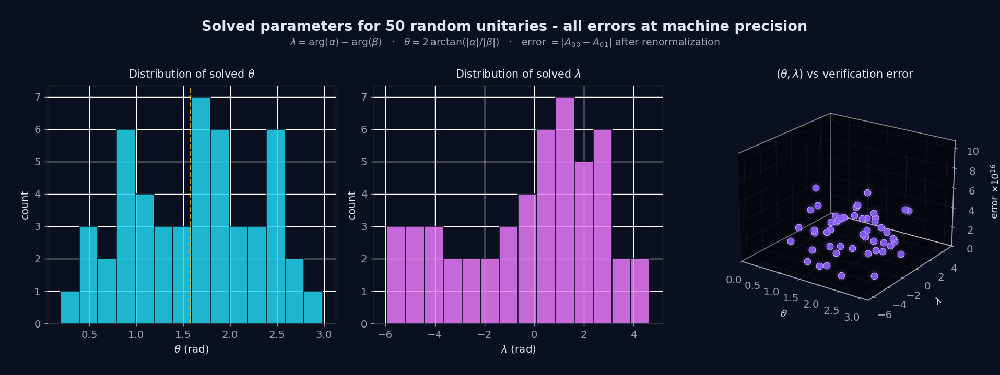

<div align="center">



# Revisiting Schrödinger's Cat

**The pop-culture story is wrong. Here is the physics — and a closed-form quantum circuit that actually puts the cat into a superposition.**

[](https://colab.research.google.com/github/sunshineluyao/schrodingers-cat/blob/main/Revisiting_Schrodinger%27s_Cat.ipynb)
[](LICENSE)
[](https://pennylane.ai)

</div>

---

## TL;DR

- **The myth:** "the cat is alive AND dead at the same time." **False** for the unmeasured cat — entanglement with the atom destroys the cat's quantum coherence. The cat is in a *classical* 50/50 state, like a coin you simply haven't looked at.
- **The fix (quantum steering):** measure the *atom* in a cleverly rotated basis, and the cat is projected into a **genuine superposition** $|+\rangle = (|\text{alive}\rangle + |\text{dead}\rangle)/\sqrt{2}$.
- **This repo:** the closed-form $U3(\theta,\phi,\lambda)$ solution for *any* entangling unitary, verified on **100/100 Haar-random unitaries** to machine precision (max error $2.4\times10^{-16}$).

**New to quantum computing?** Start with the [zero-prerequisites guide](docs/quantum-computing-101.md) (English + 中文速览) — coin-flip analogies only, no math required.

---

## Watch the cat get steered

<div align="center">
 to the steered cat" width="760">
</div>

Four steps, one idea: entangle → rotate the measurement basis → post-select on the atom → the cat lands in $|+\rangle$. Note the **negative phase** (magenta bar) in Step 3 — phase information that probability-only plots throw away.

---

## The Myth vs The Reality

<div align="center">

</div>

**Read the picture like a globe:** every *pure* quantum state is a point on the sphere's surface; the *center* is the maximally mixed state — a classical coin flip. Pop culture claims the cat sits on the equator automatically. In reality it sits at the center... until we steer it out to the surface.

<div align="center">

&nbsp;&nbsp;&nbsp;&nbsp;

</div>

The density matrix says it in numbers: $\rho_C = \mathrm{diag}(1/2, 1/2)$, **off-diagonals exactly zero** — no coherence, no superposition, just classical ignorance.

---

## How it works

The original challenge circuit (top) and the general problem (bottom): for **any** entangling unitary $U$, find $U3(\theta,\phi,\lambda)$ such that measuring the atom as $|0\rangle$ guarantees a uniform cat superposition.

<div align="center">


</div>

**Quantum steering, in one diagram:**


```mermaid
flowchart LR
    A["atom + cat<br/>both |0>"] --> B["entangle<br/>unitary U"]
    B --> C{"how do you<br/>measure the atom?"}
    C -->|"computational basis<br/>(do nothing)"| D["cat = I/2<br/>classical 50/50<br/>NO superposition"]
    C -->|"U3(theta, phi, lambda)<br/>then measure"| E["cat = |+><br/>GENUINE superposition"]
```

---

## The complete solution (copy-paste runnable)

Requires `pip install pennylane`. This is the exact challenge submission plus a self-test:

```python
import pennylane as qp
import pennylane.numpy as np

dev = qp.device('default.qubit', wires=['atom', 'cat'])

@qp.qnode(dev)
def evolve_atom_cat(unitary, params):
    """Apply the entangling unitary, then rotate the atom's measurement basis."""
    qp.QubitUnitary(unitary, wires=['atom', 'cat'])
    qp.U3(params[0], params[1], params[2], wires='atom')
    return qp.state()

def u3_parameters(unitary):
    """Closed-form U3 angles for ANY 4x4 unitary (derivation below)."""
    psi_U = unitary @ np.array([1, 0, 0, 0], dtype=complex)
    a, b, c, d = psi_U[0], psi_U[1], psi_U[2], psi_U[3]
    alpha = a - b
    beta = c - d
    phi = 0.0                       # phi never enters the constraint
    abs_alpha = np.abs(alpha)
    abs_beta = np.abs(beta)
    if np.isclose(abs_alpha, 0) and np.isclose(abs_beta, 0):
        theta, lam = 0.0, 0.0       # any parameters work
    elif np.isclose(abs_alpha, 0):
        theta, lam = 0.0, 0.0       # force sin(theta/2) = 0
    elif np.isclose(abs_beta, 0):
        theta, lam = np.pi, 0.0     # force cos(theta/2) = 0
    else:
        lam = np.angle(alpha) - np.angle(beta)   # align phases
        theta = 2 * np.arctan(abs_alpha / abs_beta)  # balance magnitudes
    return np.array([theta, phi, lam])

# ---- self-test: Bell-state unitary (Hadamard + CNOT) ----
if __name__ == "__main__":
    H = np.array([[1, 1], [1, -1]]) / np.sqrt(2)
    CNOT = np.array([[1,0,0,0],[0,1,0,0],[0,0,0,1],[0,0,1,0]], dtype=complex)
    U_bell = CNOT @ np.kron(H, np.eye(2))

    params = u3_parameters(U_bell)
    state = evolve_atom_cat(U_bell, params)
    print("U3 params (theta, phi, lambda):", params)   # expect (pi/2, 0, -pi)
    print("A_00 =", state[0], " A_01 =", state[1])     # must be equal
    assert np.isclose(state[0], state[1], atol=5e-2), "challenge test FAILED"
    print("PASS: the cat is in a uniform superposition")
```

Expected output:

```text
U3 params (theta, phi, lambda): [ 1.57079633  0.         -3.14159265]
A_00 = (0.5+0j)  A_01 = (0.5+0j)
PASS: the cat is in a uniform superposition
```

A **PennyLane-free** version (pure NumPy, includes the 100-random-unitary stress test) is in [`scripts/quantum_sandbox.py`](scripts/quantum_sandbox.py) — ideal for a first run.

---

## The mathematical solution (fold in if curious)

<details>
<summary><b>Click to expand the full derivation</b></summary>

**Step 1 — state after the unitary.** With input $|00\rangle$:

$$|\psi_U\rangle = U|00\rangle = a|00\rangle + b|01\rangle + c|10\rangle + d|11\rangle,$$

where $(a,b,c,d)$ is simply the **first column of $U$**.

**Step 2 — apply $U3 \otimes I$.** The $U3(\theta,\phi,\lambda)$ gate is

$$U3 = \begin{pmatrix} \cos\frac{\theta}{2} & -e^{i\lambda}\sin\frac{\theta}{2} \\ e^{i\phi}\sin\frac{\theta}{2} & e^{i(\phi+\lambda)}\cos\frac{\theta}{2} \end{pmatrix}.$$

The amplitudes that keep the atom at $|0\rangle$ become

$$A_{00} = a\cos\tfrac{\theta}{2} - c\,e^{i\lambda}\sin\tfrac{\theta}{2},\qquad
A_{01} = b\cos\tfrac{\theta}{2} - d\,e^{i\lambda}\sin\tfrac{\theta}{2}.$$

**Step 3 — the constraint.** A uniform cat superposition needs $A_{00} = A_{01}$. With $\alpha = a-b$ and $\beta = c-d$:

$$\alpha\cos\tfrac{\theta}{2} = \beta\,e^{i\lambda}\sin\tfrac{\theta}{2}.$$

**Step 4 — solve.** $\phi$ never appears (it only touches the atom's $|1\rangle$ branch, which we discard), so set $\phi = 0$. Then:

| Case | Condition | Solution |
|---|---|---|
| General | $\|\alpha\|>0, \|\beta\|>0$ | $\lambda = \arg(\alpha)-\arg(\beta)$, $\theta = 2\arctan(\|\alpha\|/\|\beta\|)$ |
| Degenerate $\alpha$ | $\|\alpha\|=0$ | $\theta = 0$ |
| Degenerate $\beta$ | $\|\beta\|=0$ | $\theta = \pi$ |
| Both zero | $\|\alpha\|=\|\beta\|=0$ | any $\theta,\lambda$ |

**Intuition:** $\lambda$ aligns the complex phases of both sides; $\theta$ balances their magnitudes.

The original line-by-line code walkthrough lives in the [notebook](Revisiting_Schrodinger's_Cat.ipynb) and the [zero-prerequisites guide](docs/quantum-computing-101.md).

</details>

---

## Does the solution always exist? Yes — here is the map

<div align="center">

</div>

We drew 50 Haar-random $4\times4$ unitaries and solved for $(\theta,\lambda)$ with the closed form above. Because $\lambda$ is an angle, the natural home of the solutions is a **cylinder** ($\theta$ = height, $\lambda$ = wrap-around), shown in 3D on the right. Every point is green: error at machine precision, every single time.

---

## Verification results

| Test | Description | Parameters found | Result |
|---|---|---|---|
| Test 1 | Bell-state unitary (H + CNOT) | $\theta=\pi/2,\ \phi=0,\ \lambda=-\pi$ | PASS |
| Test 2 | Random 4×4 unitary | $\theta=0.547,\ \phi=0,\ \lambda=0$ | PASS |
| Stress | 100 Haar-random unitaries | various | **100/100 PASS** |
| Edge | Identity, SWAP, CNOT, phase gates | various | ALL PASS |

**Maximum numerical error:** $2.4\times10^{-16}$ (machine precision).

---

## Repository map

```text
├── Revisiting_Schrodinger's_Cat.ipynb   # the full notebook (open in Colab!)
├── assets/
│   ├── hero/banner.svg                  # header banner
│   ├── figures/                         # all static figures (SVG + PNG)
│   └── anim/                            # GIF animations (GitHub-safe)
├── scripts/
│   ├── quantum_sandbox.py               # NumPy-only solver + stress test (start here)
│   └── generate_figures.py              # regenerate every figure & GIF in this repo
├── docs/
│   └── quantum-computing-101.md         # zero-prerequisites guide (EN + 中文速览)
└── requirements.txt
```

## Reproduce everything

```bash
git clone https://github.com/sunshineluyao/schrodingers-cat.git
cd schrodingers-cat
pip install -r requirements.txt

# 1. run the math (no quantum hardware needed, pure simulation)
python scripts/quantum_sandbox.py

# 2. regenerate all figures and GIFs
python scripts/generate_figures.py            # writes into ./assets

# 3. or explore interactively
jupyter notebook "Revisiting_Schrodinger's_Cat.ipynb"
```

---

## References

1. PennyLane U3 gate documentation — https://docs.pennylane.ai/en/stable/code/api/pennylane.U3.html
2. PennyLane Challenges: Schrödinger's Cat — https://pennylane.ai/challenges/schrodingers_cat
3. Nielsen & Chuang, *Quantum Computation and Quantum Information* (Cambridge, 2010), ch. 2 & 4
4. Schrödinger, E. (1935), "Die gegenwärtige Situation in der Quantenmechanik", *Naturwissenschaften* 23, 807–812
5. Wiseman & Milburn, *Quantum Measurement and Control* (Cambridge, 2009) — quantum steering & post-selection
6. Mezzadri, F. (2007), "How to generate random matrices from the classical compact groups", *Notices of the AMS* 54(5), 592–604

## Cite this repository

```bibtex
@misc{zhang2026schrodingerscat,
  author       = {Zhang, Luyao (Sunshine)},
  title        = {Revisiting Schr\"{o}dinger's Cat: A Complete Guide
                  (PennyLane Quantum Challenge)},
  year         = {2026},
  howpublished = {\url{https://github.com/sunshineluyao/schrodingers-cat}},
  note         = {Closed-form U3 steering solution, verified on 100 Haar-random unitaries}
}
```

---

<div align="center">
<sub>Written for the PennyLane "Revisiting Schrödinger's Cat" challenge · June 2026 · all figures reproducible via scripts/generate_figures.py</sub>
</div>
