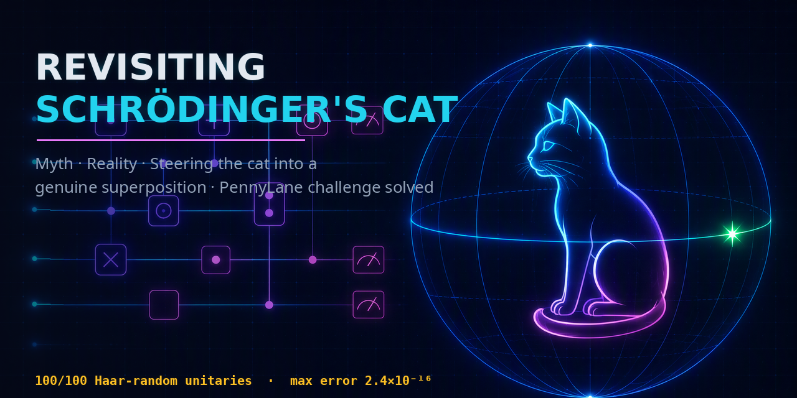
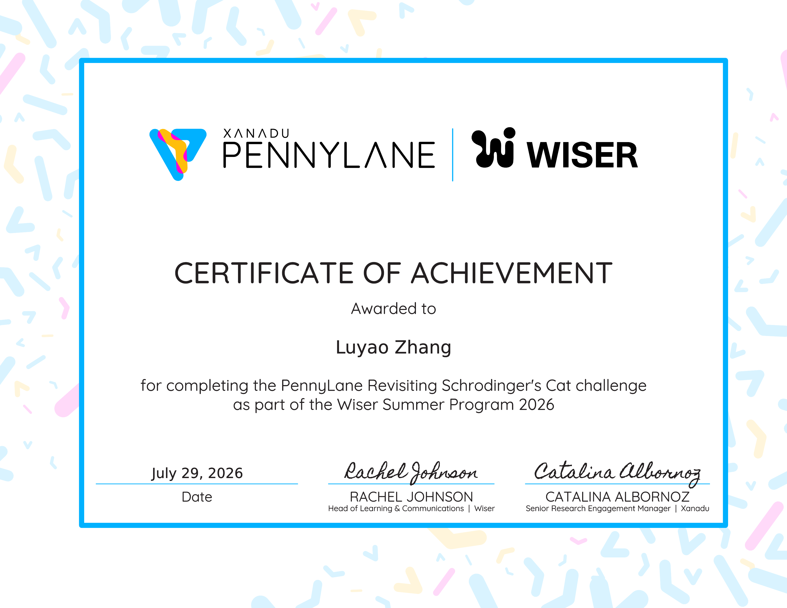
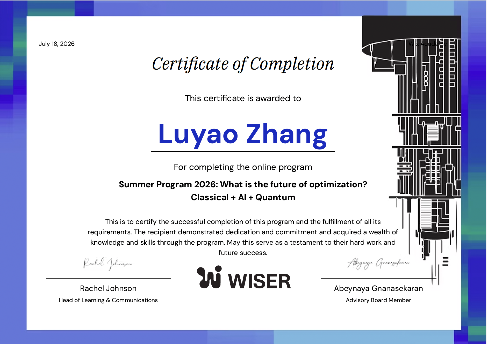

<div align="center">



# Revisiting Schrödinger's Cat

**Did we really prepare a quantum cat—or did an algebraic test merely say `PASS`?**

[](https://colab.research.google.com/github/sunshineluyao/schrodingers-cat/blob/main/Revisiting_Schrodinger%27s_Cat.ipynb)
[](https://huggingface.co/spaces/zlysunshine/did-we-really-prepare-the-quantum-cat)
[](LICENSE)
[](https://pennylane.ai)

</div>

---

## The answer in one minute

This repository begins with a familiar story and ends with a stricter scientific question.

| Question | Short answer |
|---|---|
| Is the unmeasured cat automatically in $|+\rangle=(|\text{alive}\rangle+|\text{dead}\rangle)/\sqrt2$? | **No.** Its reduced state is a classical-looking 50/50 mixture with no local coherence. |
| Can measuring the atom steer the cat into $|+\rangle$? | **Yes**, on a suitable, non-zero post-selected branch. |
| Does $A_{00}=A_{01}$ alone prove success? | **No.** The equality also accepts the empty branch $A_{00}=A_{01}=0$. |
| What makes the claim trustworthy? | A closed-form derivation, randomized implementation tests, and deterministic physical counterexamples—used together. |

**New to quantum computing?** Start with the [interactive zero-prerequisite OER](https://huggingface.co/spaces/zlysunshine/did-we-really-prepare-the-quantum-cat), then use the [longer concept guide](docs/quantum-computing-101.md) (English + 中文速览).

> The original notebook remains the PennyLane Challenge solution. The OER and this README ask the next question: does passing the challenge's amplitude-equality test guarantee a physically realizable conditional state?

---

## Q1 — Is Schrödinger's cat already “alive and dead at the same time”?

**Not as a local state of the cat.** After the atom and cat become maximally entangled, their joint state can be

$$
|\Phi^+\rangle_{AC}
=\frac{|0\rangle_A|0\rangle_C+|1\rangle_A|1\rangle_C}{\sqrt2}.
$$

The *joint* atom–cat system is in a coherent entangled superposition. But if we ignore the atom and examine only the cat, we trace the atom out:

$$
\rho_C=\mathrm{Tr}_A\!\left(|\Phi^+\rangle\langle\Phi^+|\right)
=\frac12|0\rangle\langle0|+\frac12|1\rangle\langle1|
=\frac{I}{2}.
$$

The diagonal entries give 50/50 probabilities; the off-diagonal entries—the cat's local coherence—are zero. So the cat alone sits at the **center** of the Bloch sphere, not on its surface at $|+\rangle$.

<div align="center">

</div>

<div align="center">

&nbsp;&nbsp;&nbsp;&nbsp;

</div>

The GIF is a teaching interpolation between two state descriptions, not the literal continuous-time trajectory of one cat during measurement.

---

## Q2 — If the cat is mixed, how can it become a genuine superposition?

By **quantum steering**: choose a measurement basis for the atom, measure it, and keep a specified outcome. Conditioned on that outcome, the cat can land in

$$
|+\rangle_C=\frac{|0\rangle_C+|1\rangle_C}{\sqrt2}.
$$

<div align="center">

</div>

The logic has four steps:

1. prepare the atom and cat in $|00\rangle$;
2. entangle them with a two-qubit unitary $U$;
3. rotate the atom's measurement basis with $U3(\theta,\phi,\lambda)$;
4. measure the atom and post-select its $|0\rangle$ outcome.

Post-selection is conditional: it describes the retained subensemble. It neither guarantees that the selected outcome occurs nor enables faster-than-light signalling.

---

## Q3 — What exactly did the PennyLane challenge ask us to solve?

The original circuit is shown first; the generalized circuit is shown second.

<div align="center">


</div>

For a fixed input $|00\rangle$, only the first column of $U$ matters:

$$
U|00\rangle=a|00\rangle+b|01\rangle+c|10\rangle+d|11\rangle.
$$

After applying $U3(\theta,\phi,\lambda)$ to the atom, the two amplitudes in the atom-$|0\rangle$ branch are

$$
A_{00}=a\cos\frac{\theta}{2}-c\,e^{i\lambda}\sin\frac{\theta}{2},
$$

$$
A_{01}=b\cos\frac{\theta}{2}-d\,e^{i\lambda}\sin\frac{\theta}{2}.
$$

The challenge validator asks for

$$
A_{00}=A_{01}.
$$

If this branch is non-zero, equal amplitudes mean its normalized cat state is $|+\rangle$ up to a global phase. The phrase **“if this branch is non-zero”** is the crucial physical qualification.

---

## Q4 — Can the measurement basis be solved analytically?

**Yes—no optimizer is required.** Define

$$
\alpha=a-b,\qquad \beta=c-d.
$$

Then the equality condition becomes

$$
\alpha\cos\frac{\theta}{2}
=\beta e^{i\lambda}\sin\frac{\theta}{2}.
$$

For the general case $|\alpha|>0$ and $|\beta|>0$,

$$
\lambda=\arg(\alpha)-\arg(\beta),
\qquad
\theta=2\arctan\frac{|\alpha|}{|\beta|},
\qquad
\phi=0.
$$

- $\lambda$ aligns the two complex phases.
- $\theta$ balances the two magnitudes.
- $\phi$ only changes the discarded atom-$|1\rangle$ branch, so it does not enter the equality constraint.

| Case | Condition | One valid equality solution |
|---|---|---|
| General | $|\alpha|>0,\ |\beta|>0$ | $\lambda=\arg(\alpha)-\arg(\beta)$, $\theta=2\arctan(|\alpha|/|\beta|)$ |
| Degenerate $\alpha$ | $|\alpha|=0,\ |\beta|>0$ | $\theta=0$ |
| Degenerate $\beta$ | $|\beta|=0,\ |\alpha|>0$ | $\theta=\pi$ |
| Both zero | $|\alpha|=|\beta|=0$ | any $\theta,\lambda$ satisfies equality |

<details>
<summary><b>Why does the closed form work?</b></summary>

For non-zero $\alpha$ and $\beta$, the chosen $\lambda$ makes $\beta e^{i\lambda}$ point in the same complex direction as $\alpha$. The chosen $\theta$ gives

$$
\cos\frac{\theta}{2}=\frac{|\beta|}{\sqrt{|\alpha|^2+|\beta|^2}},
\qquad
\sin\frac{\theta}{2}=\frac{|\alpha|}{\sqrt{|\alpha|^2+|\beta|^2}}.
$$

Both sides therefore have the same phase and the same magnitude

$$
\frac{|\alpha||\beta|}{\sqrt{|\alpha|^2+|\beta|^2}}.
$$

The degenerate rows force the remaining sine or cosine factor to zero. This proves the amplitude-equality formula for every input column $(a,b,c,d)$.

</details>

---

## Q5 — If the amplitudes are equal, have we prepared the cat?

**Not necessarily.** Equality is an algebraic condition; preparation is a physical claim.

First ask whether the selected branch can occur:

$$
p_0=|A_{00}|^2+|A_{01}|^2.
$$

Only when $p_0>0$ does the conditional cat state exist:

$$
|\mathrm{cat}_0\rangle
=\frac{A_{00}|0\rangle+A_{01}|1\rangle}{\sqrt{p_0}}.
$$

Then ask whether that state is the target:

$$
F=|\langle+|\mathrm{cat}_0\rangle|^2.
$$

So a complete success claim requires:

1. **amplitude equality:** $A_{00}\approx A_{01}$;
2. **reachability:** $p_0>0$;
3. **conditional correctness:** $F\approx1$.

If $p_0=0$, normalization divides by zero. No conditional state exists, so fidelity must be reported as **N/A**, not zero.

| Case | Equality validator | $p_0$ | $F$ | Physical conclusion |
|---|---|---:|---:|---|
| Bell preparation: $(H\otimes I)$ then CNOT | PASS; $A_{00}=A_{01}=0.5$ | $0.5$ | $1$ | Reachable and correct |
| CNOT on $|00\rangle$ | PASS; $A_{00}=A_{01}=0$ | $0$ | N/A | Unreachable: the selected branch never occurs |

This is the central loophole: **$0=0$ is true, but it does not prepare a quantum state.**

For a Schmidt-rank-2 state $U|00\rangle$, the cat's reduced state has full support, so a non-zero branch steering it to $|+\rangle$ exists. Rank-1 boundary cases require the separate reachability check above.

---

## Q6 — If we have a derivation, why run numerical simulations?

Because a correct formula can still be implemented incorrectly.

<div align="center">

</div>

The figure uses **50 Haar-random $4\times4$ unitaries** to visualize the solved angles and their equality errors. The script then uses **100 Haar-random unitaries** as a larger stress test.

The third panel is a 3D scatter in $(\theta,\lambda,\text{error})$. Because $\lambda$ is periodic, the $(\theta,\lambda)$ parameter domain can be interpreted topologically as a cylinder; the plot itself is not a drawn cylinder.

The randomized tests check that:

- the code extracts the correct first column of $U$;
- phase alignment and magnitude balancing are implemented correctly;
- the returned angles make $A_{00}$ and $A_{01}$ equal to floating-point precision;
- the implementation works across many typical complex-valued inputs.

The maximum observed amplitude-equality error is $2.4\times10^{-16}$—machine precision.

But randomized agreement is **not** a proof of the formula, and it does **not** establish physical validity for every boundary case.

---

## Q7 — Why test a deterministic counterexample if 100/100 random tests pass?

Because exact zero-probability branches form a measure-zero boundary. Haar-random sampling almost surely produces a Schmidt-rank-2 state and almost surely misses that boundary, no matter how visually convincing a 100/100 pass rate looks.

A deliberately chosen case such as CNOT acting on $|00\rangle$ exposes the semantic gap immediately:

$$
\mathrm{CNOT}|00\rangle=|00\rangle.
$$

For the returned degenerate equality solution, the retained atom-$|0\rangle$ branch has

$$
A_{00}=A_{01}=0,
\qquad p_0=0.
$$

The original equality assertion passes, yet the claimed conditional state is physically undefined. Identity, SWAP, and suitable phase-gate inputs reveal the same class of boundary failure.

A deterministic counterexample is therefore not competing with the random test. It asks a different question that random sampling is structurally unlikely to ask.

---

## Q8 — How can I explore and reproduce the project?

The fastest route is the [Colab notebook](https://colab.research.google.com/github/sunshineluyao/schrodingers-cat/blob/main/Revisiting_Schrodinger%27s_Cat.ipynb). For a local run:

```bash
git clone https://github.com/sunshineluyao/schrodingers-cat.git
cd schrodingers-cat
pip install -r requirements.txt

# Run the NumPy-only solver and 100-unitary stress test
python scripts/quantum_sandbox.py

# Regenerate all static figures and GIFs
python scripts/generate_figures.py

# Explore the original challenge notebook
jupyter notebook "Revisiting_Schrodinger's_Cat.ipynb"
```

<details>
<summary><b>Show the copy-paste PennyLane solution</b></summary>

```python
import pennylane as qp
import pennylane.numpy as np

dev = qp.device("default.qubit", wires=["atom", "cat"])

@qp.qnode(dev)
def evolve_atom_cat(unitary, params):
    qp.QubitUnitary(unitary, wires=["atom", "cat"])
    qp.U3(params[0], params[1], params[2], wires="atom")
    return qp.state()

def u3_parameters(unitary):
    """Closed-form U3 angles for the challenge equality condition."""
    a, b, c, d = unitary @ np.array([1, 0, 0, 0], dtype=complex)
    alpha = a - b
    beta = c - d
    abs_alpha = np.abs(alpha)
    abs_beta = np.abs(beta)
    phi = 0.0

    if np.isclose(abs_alpha, 0) and np.isclose(abs_beta, 0):
        theta, lam = 0.0, 0.0
    elif np.isclose(abs_alpha, 0):
        theta, lam = 0.0, 0.0
    elif np.isclose(abs_beta, 0):
        theta, lam = np.pi, 0.0
    else:
        lam = np.angle(alpha) - np.angle(beta)
        theta = 2 * np.arctan(abs_alpha / abs_beta)

    return np.array([theta, phi, lam])

H = np.array([[1, 1], [1, -1]]) / np.sqrt(2)
CNOT = np.array(
    [[1, 0, 0, 0],
     [0, 1, 0, 0],
     [0, 0, 0, 1],
     [0, 0, 1, 0]],
    dtype=complex,
)
U_bell = CNOT @ np.kron(H, np.eye(2))

params = u3_parameters(U_bell)
state = evolve_atom_cat(U_bell, params)
assert np.isclose(state[0], state[1], atol=5e-2)
print("PASS: equal-amplitude challenge condition")
```

This assertion reproduces the original challenge condition. For a physical preparation claim, also compute $p_0$ and conditional fidelity $F$ using the equations above. The [interactive OER](https://huggingface.co/spaces/zlysunshine/did-we-really-prepare-the-quantum-cat) demonstrates both the reachable Bell case and the zero-probability CNOT counterexample.

</details>

---

## Q9 — Where is everything in the repository?

```text
├── Revisiting_Schrodinger's_Cat.ipynb   # original challenge notebook
├── assets/
│   ├── hero/                            # banners
│   ├── figures/                         # static SVG and PNG figures
│   └── anim/                            # GitHub-safe GIF animations
├── scripts/
│   ├── quantum_sandbox.py               # NumPy solver + 100-unitary stress test
│   └── generate_figures.py              # reproducible figure/GIF generator
├── docs/
│   └── quantum-computing-101.md         # concept guide (EN + 中文速览)
├── oer/
│   ├── index.html                       # interactive physical-validity lesson
│   ├── README.md                        # Hugging Face Space configuration
│   └── assets/                          # self-contained deployment assets
├── certificates/                        # PennyLane and WISER records
├── Citation.cff                         # GitHub citation metadata
└── requirements.txt
```

---

## Q10 — What is the project's provenance?

This project was completed as part of the **PennyLane “Revisiting Schrödinger's Cat” challenge** and the **WISER 2026 summer program**.

<div align="center">

&nbsp;&nbsp;

</div>

All certificate files (PDF / PNG / SVG) are collected in [`certificates/`](certificates/).

---

## Q11 — What should I read or cite?

### References

1. [PennyLane: Revisiting Schrödinger's Cat challenge](https://pennylane.ai/challenges/schrodingers_cat)
2. [PennyLane U3 gate documentation](https://docs.pennylane.ai/en/stable/code/api/pennylane.U3.html)
3. Nielsen & Chuang, *Quantum Computation and Quantum Information* (Cambridge, 2010), ch. 2 & 4
4. Schrödinger, E. (1935), “Die gegenwärtige Situation in der Quantenmechanik,” *Naturwissenschaften* 23, 807–812
5. Wiseman & Milburn, *Quantum Measurement and Control* (Cambridge, 2009) — quantum steering and post-selection
6. Mezzadri, F. (2007), “How to generate random matrices from the classical compact groups,” *Notices of the AMS* 54(5), 592–604

This repository ships a [`Citation.cff`](Citation.cff) file, which powers GitHub's **Cite this repository** button. If you use this work, please cite:

```bibtex
@misc{zhang2026schrodingerscat,
  author = {Zhang, Luyao (Sunshine)},
  title  = {Revisiting Schr\"{o}dinger's Cat: A Complete Guide
            (PennyLane Quantum Challenge)},
  year   = {2026},
  url    = {https://github.com/sunshineluyao/schrodingers-cat},
  note   = {Closed-form U3 equality solution, randomized verification,
            deterministic physical-validity tests, and an interactive OER}
}
```

---

## Q12 — What do the three forms of evidence establish together?

They answer three different scientific questions.

| Evidence layer | Question it answers | What it establishes | What it cannot establish alone |
|---|---|---|---|
| **Mathematical derivation** | Is the equal-amplitude formula correct for the stated algebraic problem? | The closed form satisfies $A_{00}=A_{01}$, including degenerate cases. | Whether the code implements the formula correctly; whether the selected branch has non-zero probability. |
| **Randomized numerical simulation** | Did we implement the formula correctly on diverse, typical inputs? | 100/100 Haar-random tests reach machine-precision amplitude equality. | A universal proof; reliable coverage of measure-zero boundaries; physical meaning of a `PASS`. |
| **Deterministic counterexample** | Does the validator's `PASS` always mean a realizable quantum state? | No: $A_{00}=A_{01}=0$ passes equality while $p_0=0$ and $F$ is undefined. | The general closed-form solution or broad implementation reliability. |

The complete verification record is therefore:

| Test | Equality result | Reachability result | Correct interpretation |
|---|---|---|---|
| Bell preparation | $A_{00}=A_{01}=0.5$ | $p_0=0.5$ | Reachable; $F=1$ |
| One sampled random unitary | PASS | $p_0>0$ almost surely | Reachable for that sampled full-rank state |
| 100 Haar-random unitaries | **100/100 PASS** | Exact zero is almost surely not sampled | Implementation stress test, not a boundary proof |
| Identity, SWAP, CNOT, or phase gate on $|00\rangle$ | Can PASS with $A_{00}=A_{01}=0$ | $p_0=0$ | Unreachable; $F$ is N/A |

> **Final lesson:** the mathematical derivation proves the equal-amplitude formula; randomized simulation checks its implementation; deterministic counterexamples test its physical meaning. **All three are indispensable.**

This is the broader trustworthy-computing principle behind the project: a syntactically satisfied assertion is not yet an operationally reachable outcome, and an operational outcome is not yet the intended physical state.

---

<div align="center">
<sub>PennyLane challenge solution · interactive physical-validity OER added August 2026 · all figures reproducible via scripts/generate_figures.py</sub>
</div>
